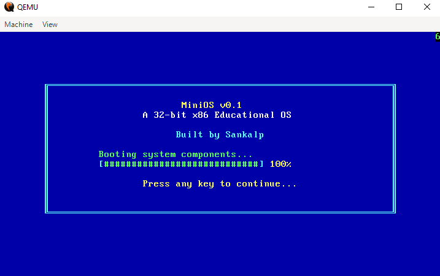
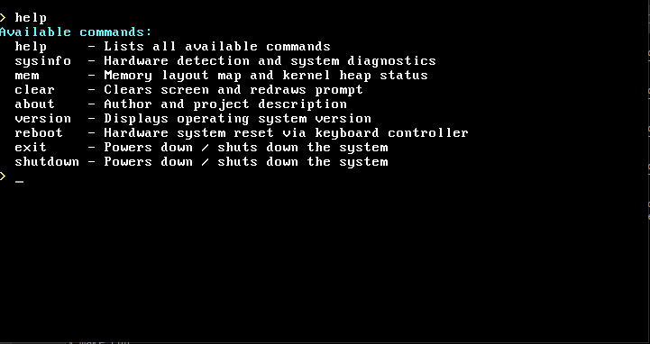
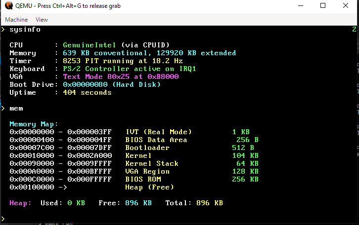

# SankalpOS — 32-Bit x86 Monolithic Operating System

> **A bare-metal, monolithic 32-bit x86 educational operating system written from scratch in x86 Assembly (NASM) and Freestanding C (C99). Features a custom two-stage bootloader, GDT/A20 protected mode switch, complete interrupt and exception subsystem (IDT & 8259 PIC), PIT timer, PS/2 keyboard ring buffer, dynamic heap allocator (`kmalloc`/`kfree`), and an interactive command shell.**

---







---

## Table of Contents
1. [Project Overview](#1-project-overview)
2. [Physical Memory Map](#2-physical-memory-map)
3. [End-to-End Boot Pipeline & System Architecture](#3-end-to-end-boot-pipeline--system-architecture)
4. [Detailed Subsystem Architecture & Implementation](#4-detailed-subsystem-architecture--implementation)
   - [4.1 Bootloader & Real-Mode Initialization (`boot/boot.asm`)](#41-bootloader--real-mode-initialization-bootbootasm)
   - [4.2 GDT & The 32-Bit Protected Mode Switch](#42-gdt--the-32-bit-protected-mode-switch)
   - [4.3 Kernel Entry & Freestanding C Runtime (`kernel/kernel_entry.asm`, `linker.ld`)](#43-kernel-entry--freestanding-c-runtime-kernelkernel_entryasm-linkerld)
   - [4.4 VGA Text Mode Display Driver (`kernel/screen.c`, `kernel/screen.h`)](#44-vga-text-mode-display-driver-kernelscreenc-kernelscreenh)
   - [4.5 Interrupt Descriptor Table (IDT) & Exception Handling (`kernel/idt.c`, `kernel/isr.c`, `kernel/stubs.asm`)](#45-interrupt-descriptor-table-idt--exception-handling-kernelidtc-kernelisrc-kernelstubsasm)
   - [4.6 8259 PIC Remapping & Hardware IRQs (`kernel/irq.c`, `kernel/irq.h`)](#46-8259-pic-remapping--hardware-irqs-kernelirqc-kernelirqh)
   - [4.7 8253 Programmable Interval Timer (PIT) Driver](#47-8253-programmable-interval-timer-pit-driver)
   - [4.8 PS/2 Keyboard Driver & Asynchronous Ring Buffer (`kernel/keyboard.c`)](#48-ps2-keyboard-driver--asynchronous-ring-buffer-kernelkeyboardc)
   - [4.9 Welcome Splash Screen & Animated UI (`kernel/splash.c`)](#49-welcome-splash-screen--animated-ui-kernelsplashc)
   - [4.10 Kernel Dynamic Memory Allocator (`kernel/mem.c`, `kernel/mem.h`)](#410-kernel-dynamic-memory-allocator-kernelmemc-kernelmemh)
   - [4.11 Interactive Command Shell (`kernel/shell.c`)](#411-interactive-command-shell-kernelshellc)
5. [Critical Engineering Pitfalls Solved](#5-critical-engineering-pitfalls-solved)
6. [Directory Structure](#6-directory-structure)
7. [Building and Running](#7-building-and-running)
8. [Comprehensive Technical Interview Preparation Guide](#8-comprehensive-technical-interview-preparation-guide)
   - [Category A: PC Boot Process & Real Mode](#category-a-pc-boot-process--real-mode)
   - [Category B: Protected Mode, GDT & Memory Addressing](#category-b-protected-mode-gdt--memory-addressing)
   - [Category C: Interrupts, IDT & 8259 PIC](#category-c-interrupts-idt--8259-pic)
   - [Category D: Memory Management & Heap Allocation](#category-d-memory-management--heap-allocation)
   - [Category E: Device Drivers, Port I/O & Embedded Systems](#category-e-device-drivers-port-io--embedded-systems)
   - [Category F: Bare-Metal C, Linkers & Toolchains](#category-f-bare-metal-c-linkers--toolchains)

---

## 1. Project Overview

* **Architecture:** 32-bit x86 (`i686`)
* **Target Environment:** IBM PC Compatible / Bare Metal (Tested on QEMU)
* **Boot Standard:** BIOS MBR (Master Boot Record)
* **Kernel Model:** Monolithic Kernel
* **Binary Format:** Flat Binary (Raw machine code, zero OS/PE/ELF headers)
* **External Dependencies:** None (Zero standard libraries; 100% freestanding C and hand-crafted Assembly)
* **Languages:** C99 (85%), x86 Assembly NASM (15%)
* **Total Kernel Footprint:** ~10 KB (20 sectors on disk)

---

## 2. Physical Memory Map

SankalpOS uses a deterministic physical memory layout in the first 2 MB of RAM:

| Physical Address Range | Size | Component / Purpose | Mode Active |
|---|---|---|---|
| `0x00000000` - `0x000003FF` | 1 KB | **Interrupt Vector Table (IVT)** | 16-bit Real Mode |
| `0x00000400` - `0x000004FF` | 256 B | **BIOS Data Area (BDA)** | BIOS / Real Mode |
| `0x00000500` - `0x00006FFF` | ~26.7 KB | Free Low Memory | Real / Protected |
| `0x00007000` - `0x00007007` | 8 B | **Hardware Configuration Mailbox** (RAM sizes, boot drive) | Saved in RM, Read in PM |
| `0x00007C00` - `0x00007DFF` | 512 B | **Boot Sector / MBR** (Loaded by BIOS) | Real Mode |
| `0x00007E00` - `0x0000FFFF` | ~32.5 KB | Free Low Memory | Protected Mode |
| `0x00010000` - `0x0002A000` | ~104 KB | **Kernel Binary** (`.text`, `.rodata`, `.data`, `.bss`) | 32-bit Protected Mode |
| `0x0002A000` - `0x0008FFFF` | ~408 KB | Free System Memory | Protected Mode |
| `0x00090000` - `0x0009FFFF` | 64 KB | **Kernel Stack** (Grows downward from `0x90000`) | 32-bit Protected Mode |
| `0x000A0000` - `0x000B7FFF` | 96 KB | Video Graphics RAM (VGA Graphics) | Hardware MMIO |
| `0x000B8000` - `0x000BFFFF` | 32 KB | **VGA Text Buffer** (80x25 Color Screen Buffer) | Hardware MMIO |
| `0x000C0000` - `0x000FFFFF` | 256 KB | Video BIOS / BIOS ROM Expansion | Motherboard ROM |
| `0x00100000` - `0x001E0000` | 896 KB | **Kernel Dynamic Heap** (`kmalloc` / `kfree`) | 32-bit Protected Mode |

---

## 3. End-to-End Boot Pipeline & System Architecture

```
+-----------------------------------------------------------------------------------+
| 1. BIOS Power-On: CPU starts at 0xFFFFFFF0. POST checks hardware.                 |
|    BIOS reads Sector 1 (512 bytes) of boot drive to RAM at 0x0000:0x7C00.         |
+-----------------------------------------+-----------------------------------------+
                                          |
                                          v
+-----------------------------------------------------------------------------------+
| 2. Boot Sector Execution (boot/boot.asm):                                         |
|    - Captures BIOS Boot Drive from DL register -> saved to 0x7006.                |
|    - Sets DS=ES=SS=0, SP=0x7C00 (stack grows down from bootloader).               |
|    - INT 0x12: Queries conventional memory (KB) -> saved to 0x7000.               |
|    - INT 0x15 (AX=0xE801): Queries extended memory (KB) -> saved to 0x7002/0x7004.|
|    - INT 0x13 (AH=0x02): Reads 30 sectors from Sector 2 into ES:BX = 0x1000:0x0000|
|      (Physical address 0x10000: segment arithmetic bypasses 16-bit truncation).   |
+-----------------------------------------+-----------------------------------------+
                                          |
                                          v
+-----------------------------------------------------------------------------------+
| 3. Protected Mode Switch (boot/boot.asm):                                         |
|    - Enables Fast Gate A20 via I/O Port 0x92.                                     |
|    - Loads 32-bit Global Descriptor Table (GDT) via LGDT instruction.             |
|    - Sets Bit 0 (Protection Enable - PE) in Control Register CR0.                 |
|    - Far Jump (jmp 0x08:0x10000) flushes 16-bit prefetch queue & sets CS=0x08.    |
+-----------------------------------------+-----------------------------------------+
                                          |
                                          v
+-----------------------------------------------------------------------------------+
| 4. 32-Bit Kernel Entry (kernel/kernel_entry.asm):                                 |
|    - Reloads data segment registers (DS, ES, FS, GS, SS) with selector 0x10.     |
|    - Sets up 32-bit Kernel Stack Pointer (ESP = 0x90000).                         |
|    - Calls C entry point: call kernel_main.                                       |
+-----------------------------------------+-----------------------------------------+
                                          |
                                          v
+-----------------------------------------------------------------------------------+
| 5. C Kernel Initialization (kernel/kernel.c):                                     |
|    - screen_init(): Clears VGA text buffer (0xB8000), configures colors.          |
|    - idt_init(): Builds 256-entry IDT, loads IDTR via LIDT.                       |
|    - isr_init(): Maps CPU Exceptions 0-31 to low-level assembly stubs.           |
|    - irq_init(): Remaps 8259 PIC (Master: 0x20, Slave: 0x28). Unmasks IRQ0/IRQ1. |
|    - timer_init(): Registers IRQ0 handler (~18.2 Hz tick counter & uptime).      |
|    - keyboard_init(): Registers IRQ1 handler, initializes PS/2 ring buffer.       |
|    - kmem_init(): Formats 896 KB dynamic heap at 0x100000 with linked-list header.|
|    - STI instruction: Hardware interrupts globally enabled.                       |
+-----------------------------------------+-----------------------------------------+
                                          |
                                          v
+-----------------------------------------------------------------------------------+
| 6. User Experience & Shell (kernel/splash.c, kernel/shell.c):                     |
|    - splash_screen(): Full-screen CP437 UI + timer-driven animated progress bar.  |
|    - keyboard_getchar(): Waits for keypress using CPU HLT instructions.           |
|    - shell_run(): Interactive REPL (help, sysinfo, mem, clear, reboot, shutdown). |
+-----------------------------------------------------------------------------------+
```

---

## 4. Detailed Subsystem Architecture & Implementation

### 4.1 Bootloader & Real-Mode Initialization (`boot/boot.asm`)
1. **512-Byte Constraint & Magic Signature:**
   The BIOS loads exactly one sector (512 bytes) from the boot medium into physical address `0x7C00`. Byte offsets 510 and 511 must contain the magic word `0xAA55`. If absent, the BIOS treats the drive as non-bootable and skips it.
2. **Dynamic Boot Drive Identification:**
   BIOS automatically supplies the active boot drive index in register `DL` (`0x00` = Floppy 1, `0x80` = Hard Disk 1). SankalpOS preserves `DL` at the very first instruction before any register alteration:
   ```nasm
   mov [BOOT_DRIVE], dl
   mov [0x7006], dl         ; Export to protected mode mailbox
   ```
3. **Hardware Probing via Real-Mode BIOS Interrupts:**
   Because BIOS interrupt vectors are unavailable in 32-bit Protected Mode, hardware parameters are interrogated in Real Mode and stored into physical address `0x7000`:
   * **`INT 0x12`:** Returns contiguous conventional memory size in `AX` (typically `639` or `640` KB). Stored at `0x7000`.
   * **`INT 0x15, AX=0xE801`:** Industry standard memory map interrogation. Returns memory between 1MB and 16MB in KB (`AX`), and memory above 16MB in 64KB blocks (`BX`). Stored at `0x7002` and `0x7004`.
4. **Segment Arithmetic Disk Loading (Bypassing 16-bit Register Truncation):**
   16-bit registers cannot represent offsets exceeding `0xFFFF`. Attempting `mov bx, 0x10000` silently truncates to `0x0000`, causing disk reads to overwrite the Real Mode Interrupt Vector Table at address 0 and instantly triple faulting.  
   **The Fix:** SankalpOS uses segment arithmetic where $\text{Address} = (\text{Segment} \times 16) + \text{Offset}$:
   ```nasm
   mov ax, 0x1000       ; 0x1000 * 16 = 0x10000 (physical)
   mov es, ax
   xor bx, bx           ; ES:BX = 0x1000:0x0000 -> Physical 0x10000
   mov ah, 0x02         ; BIOS Read Disk Sectors
   mov al, 30           ; Number of sectors to read
   mov ch, 0            ; Cylinder 0
   mov cl, 2            ; Start at Sector 2 (Sector 1 is MBR)
   mov dh, 0            ; Head 0
   mov dl, [BOOT_DRIVE]
   int 0x13
   jc disk_error        ; Carry flag set indicates hardware error
   ```

---

### 4.2 GDT & The 32-Bit Protected Mode Switch
1. **The Fast Gate A20:**
   The 8086 processor had 20 address lines (`A0`–`A19`), capping memory at 1MB. Addresses exceeding 1MB wrapped back to 0. Protected Mode requires `A20` enabled to address memory above 1MB. SankalpOS uses Fast Gate A20 via system control port `0x92`:
   ```nasm
   in al, 0x92
   or al, 2
   out 0x92, al
   ```
2. **Global Descriptor Table (GDT) Layout:**
   A GDT entry is an 8-byte structure containing:
   * **Limit (20 bits):** Maximum addressable size.
   * **Base (32 bits):** Linear starting address.
   * **Access Byte:** Present (P), Descriptor Privilege Level (DPL 00 = Ring 0), Type (Code/Data), Executable, Direction/Conforming, Readable/Writable.
   * **Granularity Flags:** Granularity ($G=1 \rightarrow 4\text{KB pages}$), Size ($D=1 \rightarrow 32\text{-bit default operands}$).

   SankalpOS implements a Flat Memory Model:
   * **Descriptor 0 (`0x00`):** Mandatory Null Descriptor (all zeros).
   * **Descriptor 1 (`0x08`):** Kernel Code Segment. Base = `0x0`, Limit = `0xFFFFF`, Granularity = 4KB ($4\text{KB} \times 0x100000 = 4\text{GB}$). Access byte `0x9A` (`10011010b` = Code, Execute/Read).
   * **Descriptor 2 (`0x10`):** Kernel Data Segment. Base = `0x0`, Limit = `0xFFFFF`, Granularity = 4KB ($4\text{GB}$). Access byte `0x92` (`10010010b` = Data, Read/Write).

3. **Atomic Mode Switch:**
   ```nasm
   cli                      ; 1. Disable real mode maskable interrupts
   lgdt [gdt_descriptor]    ; 2. Load GDTR with table size and base address
   mov eax, cr0
   or eax, 1                ; 3. Set PE (Protection Enable) Bit 0 in CR0
   mov cr0, eax
   jmp 0x08:0x10000         ; 4. Far jump flushes pipeline, sets CS=0x08, jumps to kernel
   ```

---

### 4.3 Kernel Entry & Freestanding C Runtime (`kernel/kernel_entry.asm`, `linker.ld`)
1. **Assembly Entry (`kernel_entry.asm`):**
   ```nasm
   [BITS 32]
   section .entry
   global _start
   extern kernel_main

   _start:
       mov ax, 0x10         ; Reload all segment registers with Kernel Data Selector
       mov ds, ax
       mov es, ax
       mov fs, ax
       mov gs, ax
       mov ss, ax
       mov esp, 0x90000     ; Establish 64KB stack growing downwards
       call kernel_main     ; Transfer execution into compiled C
       cli
   .hang:
       hlt                  ; Safety halt if kernel_main ever returns
       jmp .hang
   ```
2. **Linker Script Architecture (`linker.ld`):**
   Ensures `.entry` is positioned at physical offset `0x10000`:
   ```ld
   ENTRY(_start)
   SECTIONS {
       . = 0x10000;
       .text : {
           *(.entry)
           *(.text*)
           *(.rdata*)
           *(.rodata*)
           *(.data*)
       }
       .bss : {
           *(.bss*)
           *(COMMON)
       }
   }
   ```
   *Note on Section Coalescing:* Constants and initialized data (`.rdata`, `.rodata`, `.data`) are packed contiguously into `.text`. This prevents PE/COFF 4096-byte section padding from inflating the binary beyond the 30-sector floppy budget.

---

### 4.4 VGA Text Mode Display Driver (`kernel/screen.c`, `kernel/screen.h`)
1. **Direct Memory Mapping:**
   Physical address `0xB8000` maps directly to the video controller RAM in 80-column $\times$ 25-row text mode. Each character cell occupies 2 consecutive bytes:
   $$\text{Memory Offset} = (\text{Row} \times 80 + \text{Col}) \times 2$$
   * Byte 0: ASCII character code (or CP437 glyph).
   * Byte 1: Attribute byte $\rightarrow$ `[Background (Bits 7:4)] [Foreground (Bits 3:0)]`.
2. **Hardware Cursor Synchronization:**
   The hardware cursor is controlled via CRT Controller I/O ports:
   ```c
   static void update_cursor(void) {
       uint16_t pos = cursor_y * 80 + cursor_x;
       outb(0x3D4, 0x0F);                  // Index 0x0F: Cursor Location Low
       outb(0x3D5, (uint8_t)(pos & 0xFF));
       outb(0x3D4, 0x0E);                  // Index 0x0E: Cursor Location High
       outb(0x3D5, (uint8_t)((pos >> 8) & 0xFF));
   }
   ```
3. **Screen Scrolling Engine:**
   When `cursor_y >= 25`, all 24 display rows are shifted upward by 80 cells using direct word copies, row 24 is cleared with blank spaces (`' '`), and `cursor_y` is pinned to 24.
4. **CP437 Unsigned Handling:**
   `print_char` casts characters to `uint8_t` to allow continuous rendering of IBM Code Page 437 double-line box glyphs (`0xC9` = `╔`, `0xCD` = `═`, `0xBB` = `╗`, `0xBA` = `║`, `0xC8` = `╚`, `0xBC` = `╝`).

---

### 4.5 Interrupt Descriptor Table (IDT) & Exception Handling (`kernel/idt.c`, `kernel/isr.c`, `kernel/stubs.asm`)
1. **IDT Gate Structure:**
   The IDT contains 256 8-byte gate descriptors:
   ```c
   struct idt_entry {
       uint16_t base_low;   // Bits 0..15 of handler function address
       uint16_t sel;        // Segment selector (0x08 = Kernel Code)
       uint8_t  always0;    // Reserved byte, must be 0
       uint8_t  flags;      // 0x8E = Present, Ring 0, 32-bit Interrupt Gate
       uint16_t base_high;  // Bits 16..31 of handler function address
   } __attribute__((packed));
   ```
2. **CPU Exception Handlers (ISRs 0–31):**
   When the CPU encounters a fault, it raises a hardware exception:
   * Vectors 8, 10–14, 17, 30 push an error code onto the stack automatically.
   * All other exceptions do not push an error code.
   * **The Assembly Stub Normalizer:** NASM macros push a dummy error code (`0`) for non-error exceptions so the stack layout remains identical for all handlers:
     ```nasm
     %macro ISR_NOERRCODE 1
     global isr%1
     isr%1:
         push dword 0        ; Dummy error code
         push dword %1       ; Interrupt number
         jmp isr_common_stub
     %endmacro
     ```
3. **CPU State Preservation:**
   `isr_common_stub` executes `pusha`, pushes the `DS` register, switches segment registers to `0x10`, and passes a pointer to `registers_t` into C function `isr_handler()`. When complete, `popa` and `iret` restore execution state.

---

### 4.6 8259 PIC Remapping & Hardware IRQs (`kernel/irq.c`, `kernel/irq.h`)
1. **The Vector Collision Conflict:**
   By default, the IBM PC BIOS programs the Master 8259 PIC to fire IRQs 0–7 on interrupt vectors `0x08`–`0x0F`. However, in 32-bit Protected Mode, Intel reserved vectors `0x08`–`0x0F` for CPU hardware exceptions (Double Fault, Invalid TSS, Segment Not Present, Stack Fault, GPF). Without remapping, any timer tick triggers an unhandled Double Fault exception!
2. **The Remapping Sequence:**
   SankalpOS remaps the PICs through the 4 Initialization Command Words (ICWs):
   * **`ICW1` (Ports `0x20`, `0xA0`):** `0x11` $\rightarrow$ Initialize cascade mode, expect ICW4.
   * **`ICW2` (Ports `0x21`, `0xA1`):** Vector offsets $\rightarrow$ Master PIC offset = `0x20` (INT 32–39), Slave PIC offset = `0x28` (INT 40–47).
   * **`ICW3` (Ports `0x21`, `0xA1`):** Master has slave on IRQ2 (`0x04`); Slave identity = 2 (`0x02`).
   * **`ICW4` (Ports `0x21`, `0xA1`):** `0x01` $\rightarrow$ 8086/88 mode operation.
3. **Interrupt Masking:**
   Unmasks only timer (IRQ0) and keyboard (IRQ1) on the Master PIC (`0xFC` = `11111100b`), while masking all slave interrupts (`0xFF`):
   ```c
   outb(0x21, 0xFC);
   outb(0xA1, 0xFF);
   ```
4. **End-Of-Interrupt (EOI) Handshake:**
   The 8259 PIC halts all future interrupts until it receives an EOI acknowledge byte (`0x20`) on command port `0x20`:
   ```c
   void irq_handler(registers_t* regs) {
       // Dispatch to registered handler
       if (regs->int_no >= 40) outb(0xA0, 0x20); // Slave EOI
       outb(0x20, 0x20);                         // Master EOI
   }
   ```

---

### 4.7 8253 Programmable Interval Timer (PIT) Driver
* Configured on IRQ0 (INT 32).
* Fires at approximately ~18.22 Hz (default oscillator divider 65,536 of 1.193182 MHz base frequency).
* **Live Ticking Indicator:** The IRQ0 callback increments `timer_ticks`, divides by 18, and writes a green cycling digit (`0`–`9`) directly to VGA cell 158 (row 0, column 79) every second.
* **Power-Efficient Delay:**
  ```c
  void sleep_ticks(uint32_t ticks) {
      uint32_t start = timer_ticks;
      while ((timer_ticks - start) < ticks) {
          __asm__ volatile ("hlt"); // Puts CPU to sleep until next interrupt
      }
  }
  ```

---

### 4.8 PS/2 Keyboard Driver & Asynchronous Ring Buffer (`kernel/keyboard.c`)
1. **Hardware I/O & Scancodes:**
   The PS/2 controller asserts IRQ1 (INT 33) on key state transitions. The driver reads the scan code byte from data port `0x60`.
2. **Make / Break Protocol:**
   * Key Press (Make code): Value between `0x01` and `0x39`.
   * Key Release (Break code): $\text{Make Code} + 0x80$ (Bit 7 set).
   * Filter: `if (scancode & 0x80) return;` ignores key releases.
3. **Shift State Machine:**
   Tracks Left Shift (`0x2A`) and Right Shift (`0x36`). Pressing activates `shift_active = 1`; releasing (`0xAA` or `0xB6`) clears `shift_active = 0`. Dynamically switches between lowercase and uppercase/symbol lookup tables.
4. **Circular FIFO Queue:**
   Decouples keyboard interrupts from shell execution via a 256-byte circular ring buffer:
   ```c
   char keyboard_getchar(void) {
       while (key_head == key_tail) {
           __asm__ volatile ("hlt"); // Zero CPU consumption while waiting for input
       }
       char c = key_buffer[key_tail];
       key_tail = (key_tail + 1) % KEY_BUFFER_SIZE;
       return c;
   }
   ```

---

### 4.9 Welcome Splash Screen & Animated UI (`kernel/splash.c`)
* Renders a royal blue background (`COLOR_BLUE`) with a centered 64-column double-line CP437 box.
* Progress bar animates across 28 steps (`[############################] 100%`) timed via `sleep_ticks()` over 2–3 seconds.
* Blocks on `keyboard_getchar()` until the user presses any key, then resets the screen to black and transfers control to the command shell.

---

### 4.10 Kernel Dynamic Memory Allocator (`kernel/mem.c`, `kernel/mem.h`)
1. **Heap Boundary:**
   Located at `0x100000` (1MB physical boundary) with a size of 896 KB (`0x00100000` to `0x001E0000`).
2. **Block Header Metadata:**
   Each allocated or free block begins with an intrusive 12-byte header:
   ```c
   typedef struct block {
       uint32_t      size;  // Size of usable payload in bytes
       uint8_t       used;  // 1 = Allocated, 0 = Free
       struct block* next;  // Pointer to next block in linked list
   } block_t;
   ```
3. **First-Fit `kmalloc(size)`:**
   * 4-byte aligns requested size: `size = (size + 3) & ~3`.
   * Scans linked list for the first block with `!used && curr->size >= size`.
   * **Block Splitting:** If the free block exceeds requested size by at least `sizeof(block_t) + 4`, it splits into an allocated block and a smaller trailing free block.
4. **Coalescing `kfree(ptr)`:**
   * Recovers block header: `block_t* b = (block_t*)((uint8_t*)ptr - sizeof(block_t));`.
   * Sets `b->used = 0`.
   * Iterates through the list and merges adjacent free blocks (`curr->size += sizeof(block_t) + curr->next->size; curr->next = curr->next->next;`), eliminating external memory fragmentation.

---

### 4.11 Interactive Command Shell (`kernel/shell.c`)
Implements an interactive Read-Eval-Print Loop (REPL) handling character echoes, backspaces, and command dispatch:

| Command | Technical Action |
|---|---|
| **`help`** | Displays command menu and descriptions. |
| **`sysinfo`** | Direct hardware interrogation: Executes `CPUID` instruction to extract 12-char CPU vendor string from `EBX:EDX:ECX`; reads memory sizes from `0x7000`; calculates uptime from timer ticks. |
| **`mem`** | Prints physical x86 memory map and dynamic heap statistics (Used, Free, Total KB). |
| **`clear`** | Calls `clear_screen()` and resets cursor to `(0, 0)`. |
| **`about`** | Author and architectural overview. |
| **`version`** | Displays `SankalpOS v0.1`. |
| **`reboot`** | Pulses CPU reset line by writing `0xFE` to the 8042 PS/2 controller port `0x64`. |
| **`exit` / `shutdown`** | Powers off QEMU virtual machine by sending `0x2000` to ACPI power management port `0x604` / `0xB004`. |

---

## 5. Critical Engineering Pitfalls Solved

### Bug 1: Real-Mode 16-Bit Register Truncation
* **Problem:** In 16-bit real mode, registers cannot hold `0x10000`. Executing `mov bx, 0x10000` silently truncates to `mov bx, 0x0000`. The disk read overwrote the Interrupt Vector Table at address 0, causing an immediate triple fault.
* **Solution:** Used segment arithmetic: `mov ax, 0x1000; mov es, ax; xor bx, bx`. Physical address = $0x1000 \times 16 + 0 = 0x10000$.

### Bug 2: MinGW PE/COFF Linker Errors on Flat Binaries
* **Problem:** Modern MinGW Binutils `ld` defaults to `i386pe` target emulation. Adding `OUTPUT_FORMAT("binary")` in the linker script caused `ld.exe: cannot perform PE operations on non PE output file`.
* **Solution:** Linked with base offset `--image-base 0x0 -T kernel/linker.ld -o build/kernel.pe`, followed by `objcopy -O binary -j .text build/kernel.pe build/kernel.bin` to strip all PE headers and extract raw flat binary code.

### Bug 3: MinGW Symbol Underscore Mangling
* **Problem:** MinGW GCC prefixes C symbols with underscores (`kernel_main` $\rightarrow$ `_kernel_main`), causing undefined reference errors when called from assembly `kernel_entry.asm`.
* **Solution:** Appended `-fno-leading-underscore` to GCC `CFLAGS`.

### Bug 4: SSE-Induced Triple Faults in Protected Mode
* **Problem:** Modern GCC optimizes multi-byte memory copies (such as string tables in `print_hex`) by emitting SSE 128-bit vector moves (`movups %xmm0`). Because SSE is disabled by default in `CR0`/`CR4`, executing an SSE instruction raised an unhandled General Protection Fault (`#GP`) which escalated into an instant Triple Fault.
* **Solution:** Added `-mgeneral-regs-only -mno-sse -mno-sse2 -mno-mmx` to `CFLAGS` to strictly restrict compiler code generation to 32-bit integer registers.

### Bug 5: QEMU Immediate Exit on Reboot
* **Problem:** The `-no-reboot` flag on the QEMU command line instructed the hypervisor to exit whenever a CPU reset was detected, terminating QEMU when the shell executed `reboot`.
* **Solution:** Removed `-no-reboot` from the `run` target in the `Makefile`, allowing QEMU to execute authentic warm reboot cycles.

---

## 6. Directory Structure

```
Mini_OS/
├── Makefile                # Complete build automation and disk image creation
├── README.md               # Comprehensive documentation and interview guide
├── boot/
│   └── boot.asm            # 16-bit bootloader, GDT, A20, and protected mode switch
└── kernel/
    ├── linker.ld           # Flat binary linker script (origin 0x10000)
    ├── kernel_entry.asm    # 32-bit entry point and stack setup
    ├── types.h             # Fixed-width standard integer types (uint8_t, etc.)
    ├── kernel.c            # Kernel main initialization sequence
    ├── screen.h            # VGA text mode driver header
    ├── screen.c            # VGA driver (80x25, colors, scrolling, cursor sync)
    ├── idt.h               # Interrupt Descriptor Table header
    ├── idt.c               # IDT table setup and LIDT loader
    ├── isr.h               # Exception handler prototypes & registers_t struct
    ├── isr.c               # CPU exception dispatcher (0-31)
    ├── irq.h               # Hardware IRQ prototypes & timer definitions
    ├── irq.c               # 8259 PIC remapping, IRQ dispatch, PIT timer callback
    ├── stubs.asm           # Low-level assembly ISR/IRQ interrupt wrappers
    ├── keyboard.h          # PS/2 keyboard driver header
    ├── keyboard.c          # PS/2 driver, scancode mapping, shift logic, ring buffer
    ├── splash.h            # Welcome splash screen header
    ├── splash.c            # Full-screen CP437 UI and animated progress bar
    ├── mem.h               # Dynamic memory allocator header
    ├── mem.c               # First-fit kmalloc(), kfree(), and block coalescing
    ├── shell.h             # Interactive shell header
    └── shell.c             # Interactive CLI REPL and command implementations
```

---

## 7. Building and Running

### Prerequisites
* **MSYS2 MINGW32** (Installed to `C:\msys64` or `C:\msys2`)
* Tools installed inside MSYS2 MINGW32:
  ```bash
  pacman -S mingw-w64-i686-gcc nasm make
  ```
* **QEMU for Windows** (Installed to `C:\qemu` and added to PATH)

### Compilation
Open the **MSYS2 MINGW32** terminal:
```bash
cd /d/Mini_OS
make clean
make
```

### Execution
Launch the virtual machine in QEMU:
```bash
make run
```

---

## 8. Comprehensive Technical Interview Preparation Guide

This section is engineered to prepare you for embedded systems, low-level software engineering, and operating systems interview questions.

---

### Category A: PC Boot Process & Real Mode

#### Q1: What happens when an x86 computer powers on?
> **Answer:**
> 1. Power supply stabilizes and sends the "Power Good" signal to the motherboard.
> 2. The CPU starts in **16-bit Real Mode** with register `CS:IP` initialized to `0xF000:0xFFF0` (Physical address `0xFFFF0`), known as the **Reset Vector**.
> 3. The Reset Vector contains a jump instruction to the BIOS ROM initialization firmware.
> 4. BIOS performs the Power-On Self-Test (POST) to test and enumerate system memory, video adapters, and storage controllers.
> 5. BIOS searches boot devices (floppy, disk, CD-ROM, USB) in configured boot order.
> 6. It reads Sector 1 (512 bytes) of the boot device to memory address `0x0000:0x7C00`.
> 7. BIOS checks bytes 510–511 for the signature `0xAA55`. If present, execution jumps to `0x7C00`.

#### Q2: Why is the bootloader loaded at physical address `0x7C00`?
> **Answer:**
> In early IBM PC 5150 architecture (1981), DOS 1.0 required a minimum of 32 KB of RAM. Memory from `0x0000` to `0x03FF` was reserved for the Interrupt Vector Table (IVT), and `0x0400` to `0x04FF` for the BIOS Data Area (BDA).  
> The IBM BIOS engineers chose `0x7C00` (which is $32\text{KB} - 1024\text{ bytes} = 31\text{KB}$) so that the 512-byte boot sector and its stack would reside safely at the high end of the 32 KB boundary, leaving maximum contiguous conventional memory (`0x0500` to `0x7BFF`) for the operating system to load into.

#### Q3: How does Real Mode segmentation calculate physical addresses?
> **Answer:**
> Real Mode uses 16-bit segment registers and 16-bit offsets. The CPU computes physical addresses by shifting the segment register left by 4 bits (multiplying by 16) and adding the offset:
> $$\text{Physical Address} = (\text{Segment} \times 16) + \text{Offset}$$
> For example, `0x1000:0x0000` evaluates to $(0x1000 \times 16) + 0x0000 = 0x10000$.

#### Q4: Why can't a bootloader in Real Mode load the kernel directly using `mov bx, 0x10000`?
> **Answer:**
> In 16-bit mode, register `BX` is only 16 bits wide (maximum value `0xFFFF` = 65,535). Writing `0x10000` (65,536) causes integer truncation, silently setting `BX` to `0x0000`. If passed to BIOS `INT 0x13`, disk sectors write starting at physical address `0x0000`, destroying the Real Mode Interrupt Vector Table (IVT) and causing a triple fault. The solution is segment arithmetic: load `0x1000` into `ES` and `0x0000` into `BX`.

---

### Category B: Protected Mode, GDT & Memory Addressing

#### Q5: What is the A20 Gate, and why must an operating system enable it?
> **Answer:**
> The original Intel 8086 had only 20 address lines (`A0`–`A19`), capping physical addressing at $2^{20} = 1\text{ MB}$. When an address exceeded `0xFFFFF` (e.g., `0xFFFF:0x0010`), the address wrapped back to 0. When the 80286 processor was introduced with 24 address lines, it did not wrap around, breaking backward compatibility with buggy DOS programs that relied on memory wrapping.  
> IBM added a hardware gate on the 21st address line (`A20`) linked to the keyboard controller to force address line 20 low. In 32-bit Protected Mode, if `A20` is disabled, any odd-numbered megabyte (`1MB`, `3MB`, `5MB`, etc.) wraps back to the preceding even megabyte (`0MB`, `2MB`, `4MB`). Enabling `A20` is required to address contiguous physical memory above 1MB.

#### Q6: Explain the Global Descriptor Table (GDT) and its structure.
> **Answer:**
> In Protected Mode, segment registers no longer point to physical base multipliers; they contain **Segment Selectors** that index into descriptor tables (GDT or LDT).  
> Each GDT entry is 8 bytes wide and contains:
> 1. **Base Address (32 bits):** Linear starting address of the segment.
> 2. **Segment Limit (20 bits):** Size of the segment.
> 3. **Access Byte (8 bits):**
>    * `P` (Present): 1 if segment is valid in memory.
>    * `DPL` (Privilege Level): 2 bits (00 = Ring 0 Kernel, 11 = Ring 3 User).
>    * `S` (Descriptor Type): 1 for Code/Data, 0 for System segments.
>    * `Type`: Executable, Direction/Conforming, Read/Write bits.
> 4. **Flags (4 bits):**
>    * `G` (Granularity): 0 = byte granularity (limit max 1MB), 1 = 4KB page granularity (limit max $1\text{MB} \times 4\text{KB} = 4\text{GB}$).
>    * `D/B` (Size): 1 for 32-bit protected mode operands.
>    * `L` (Long Mode): 1 for 64-bit code.

#### Q7: Why is a far jump required immediately after setting the PE bit in CR0?
> **Answer:**
> Setting bit 0 in `CR0` enables Protected Mode, but modern x86 CPUs maintain an instruction prefetch queue and shadow registers for segmentation. The instruction prefetch queue still contains pre-decoded 16-bit instructions, and `CS` still holds the old 16-bit Real Mode descriptor attributes.  
> Executing a far jump (`jmp 0x08:target`):
> 1. Immediately flushes the CPU prefetch queue, discarding 16-bit decoded instructions.
> 2. Forces the CPU to reload the `CS` shadow register with the new 32-bit Code Segment Descriptor (`0x08`) from the GDT.

---

### Category C: Interrupts, IDT & 8259 PIC

#### Q8: What is an Interrupt Descriptor Table (IDT), and how does it differ from the Real Mode IVT?
> **Answer:**
> * **Real Mode IVT:** Fixed at physical address `0x00000000`, 1024 bytes in size. Contains 256 entries, each being a 4-byte `Segment:Offset` pointer to Real Mode interrupt code.
> * **Protected Mode IDT:** Can reside anywhere in memory (loaded via `LIDT` instruction with an `idt_ptr` specifying limit and base). Contains up to 256 8-byte descriptors (Interrupt Gates, Trap Gates, or Task Gates). An Interrupt Gate (`0x8E`) stores 32-bit target handler offsets, privilege levels (DPL), code segment selectors, and automatically clears the Interrupt Flag (`IF`) in `EFLAGS` on entry to prevent nested interrupts.

#### Q9: Why must the 8259 PIC be remapped before enabling interrupts in Protected Mode?
> **Answer:**
> On the IBM PC architecture, the Master PIC defaults to vector range `0x08`–`0x0F` for hardware IRQs 0–7. However, Intel designated CPU exception vectors `0x00`–`0x1F` for processor faults (e.g., Vector 8 = Double Fault, Vector 13 = GPF, Vector 14 = Page Fault).  
> If an IRQ0 timer interrupt arrives without remapping, the CPU interprets vector `0x08` as a Double Fault exception instead of a timer tick. Remapping shifts Master PIC IRQs to vectors `0x20`–`0x27` (32–39) and Slave PIC IRQs to vectors `0x28`–`0x2F` (40–47), completely separating hardware interrupts from CPU exceptions.

#### Q10: What is an End-Of-Interrupt (EOI), and what happens if you forget to send it?
> **Answer:**
> The 8259 PIC tracks currently executing interrupts using an In-Service Register (ISR). When an interrupt fires, the PIC sets the corresponding bit in the ISR and blocks all subsequent interrupts of equal or lower priority on that PIC.  
> The CPU must explicitly issue an EOI command (`outb(0x20, 0x20)`) before returning from the interrupt handler. If omitted, the PIC keeps the bit asserted, causing the entire interrupt subsystem to lock up after servicing the very first interrupt. For IRQs 8–15 (Slave PIC), an EOI must be sent to **both** the Slave PIC (`0xA0`) and the Master PIC (`0x20`).

#### Q11: What is a Triple Fault, and how does it happen?
> **Answer:**
> A Triple Fault occurs when an exception is triggered while the CPU is attempting to invoke the Double Fault (`#DF`, Vector 8) handler.
> 1. An initial exception occurs (e.g., General Protection Fault `#GP`, Vector 13).
> 2. The CPU looks up Vector 13 in the IDT. If the IDT descriptor is missing, invalid, or points outside code segment bounds, the CPU raises a Double Fault (`#DF`, Vector 8).
> 3. The CPU attempts to invoke Vector 8. If Vector 8 in the IDT is also invalid or inaccessible, the CPU gives up and enters a **Triple Fault** condition, causing an immediate hardware reset / reboot of the PC.

---

### Category D: Memory Management & Heap Allocation

#### Q12: Explain the First-Fit dynamic memory allocation algorithm implemented in SankalpOS.
> **Answer:**
> The heap starts at physical address `0x100000` (1MB). Each block begins with an intrusive `block_t` header:
> ```c
> typedef struct block {
>     uint32_t      size;  // Payload size
>     uint8_t       used;  // 1 = allocated, 0 = free
>     struct block* next;  // Next block pointer
> } block_t;
> ```
> * **`kmalloc(size)`:** 4-byte aligns `size`. Walks the linked list from the head. The first block where `!used && block->size >= size` is chosen.
> * **Block Splitting:** If the free block is significantly larger than requested (`size + sizeof(block_t) + 4`), the block is split into an allocated front block and a remaining free trailing block.
> * **`kfree(ptr)`:** Computes header address `(uint8_t*)ptr - sizeof(block_t)`, sets `used = 0`, and iterates through the list merging adjacent free blocks (`curr->size += sizeof(block_t) + curr->next->size`).

#### Q13: What is External Fragmentation vs. Internal Fragmentation, and how does SankalpOS address them?
> **Answer:**
> * **Internal Fragmentation:** Wasted memory inside an allocated block due to alignment or minimum block size. SankalpOS uses tight 4-byte alignment, minimizing internal fragmentation to at most 3 unused bytes per allocation.
> * **External Fragmentation:** Occurs when free memory is divided into small, non-contiguous blocks that cannot satisfy larger allocation requests despite total free memory being sufficient. SankalpOS combats external fragmentation by performing **immediate adjacent block coalescing** inside `kfree()`.

---

### Category E: Device Drivers, Port I/O & Embedded Systems

#### Q14: What is the difference between Port I/O and Memory-Mapped I/O (MMIO)?
> **Answer:**
> * **Port I/O (PMP):** The x86 CPU has a separate 16-bit I/O address space (`0x0000`–`0xFFFF`) accessed exclusively via special CPU instructions (`IN`, `OUT`). Peripheral controllers like the 8259 PIC (`0x20`/`0x21`), PS/2 Keyboard (`0x60`/`0x64`), and CRT Cursor (`0x3D4`/`0x3D5`) use Port I/O.
> * **Memory-Mapped I/O (MMIO):** The device registers or buffers are mapped directly into the CPU's physical memory address space. Reading and writing to these memory addresses (`mov` instructions or C pointers) accesses the hardware directly without special instructions. The VGA text buffer at `0xB8000` is an example of MMIO.

#### Q15: How does the PS/2 keyboard controller transmit data to the CPU?
> **Answer:**
> When a key changes state, the keyboard encoder generates a scancode and transmits it serially to the 8042 PS/2 controller on the motherboard. The 8042 loads the scancode into its internal buffer at I/O port `0x60` and asserts IRQ line 1.  
> The 8259 PIC signals the CPU via the `INTR` pin. The CPU acknowledges, fetches vector 33 from the PIC, saves registers, and calls the keyboard ISR. The ISR executes `inb(0x60)` to read the scancode, processes make/break codes, pushes characters to a ring buffer, and sends an EOI byte to the PIC.

#### Q16: How does the CPU `HLT` instruction work in OS sleep routines?
> **Answer:**
> The `HLT` (Halt) instruction stops CPU instruction execution and puts the processor into a low-power quiescent state until an enabled hardware interrupt (such as IRQ0 timer or IRQ1 keyboard) or non-maskable interrupt (NMI) arrives.  
> In SankalpOS, `keyboard_getchar()` and `sleep_ticks()` execute `__asm__ volatile ("hlt")` inside polling loops. This prevents 100% busy-wait CPU utilization while guaranteeing instantaneous wakeup when hardware interrupts occur.

---

### Category F: Bare-Metal C, Linkers & Toolchains

#### Q17: What does `-ffreestanding` and `-nostdlib` mean when compiling a kernel?
> **Answer:**
> * **`-ffreestanding`:** Informs GCC that the program executes without a standard operating system environment. The compiler does not assume the presence of `main()`, standard C libraries, or runtime startup code (`crt0.o`). Built-in functions that assume OS support are suppressed.
> * **`-nostdlib`:** Instructs the linker not to link any standard system libraries (`libc`, `libm`, `libpthread`) or standard C startup routines. All functions called by the program must be implemented directly in the kernel source code.

#### Q18: Why did modern GCC emit SSE vector instructions (`movups`), and why did it crash our kernel?
> **Answer:**
> Modern GCC defaults to the i686/x86 architecture with SSE extensions enabled. When initializing or copying 16-byte structs or character arrays, GCC optimizes the copy by using 128-bit XMM registers (`movups %xmm0, ...`).  
> In Protected Mode, SSE is disabled by default in `CR0` (Bit 2 EM must be 0) and `CR4` (Bits 9 OSFXSR and 10 OSXMMEXCPT must be 1). Executing an uninitialized SSE instruction causes the CPU to generate an Invalid Opcode (`#UD`, Vector 6) or General Protection Fault (`#GP`, Vector 13). Before the IDT is installed, this causes an instant Triple Fault. Adding `-mgeneral-regs-only` and `-mno-sse` forces GCC to restrict instruction generation to general-purpose integer registers.

#### Q19: What is the purpose of the linker script in OS development?
> **Answer:**
> Compilers output independent object files (`.o`) with relative section offsets. The Linker Script (`linker.ld`):
> 1. Defines the **Virtual Memory Address (VMA)** and **Load Memory Address (LMA)** origin (in SankalpOS, `. = 0x10000`).
> 2. Enforces section ordering so that `.entry` (`kernel_entry.asm`) is located at the exact beginning of the binary, ensuring execution starts at `_start`.
> 3. Merges sections (`.text`, `.rodata`, `.data`, `.bss`) from multiple translation units.
> 4. Assigns global symbols (e.g., `_bss_start`, `_bss_end`) for runtime initialization.

---

## 9. License & Credits

* **OS Name:** SankalpOS
* **Author / Developer:** Sankalp
* **Architecture:** 32-Bit x86 Protected Mode
* **License:** MIT License — Open for educational and personal research use.

